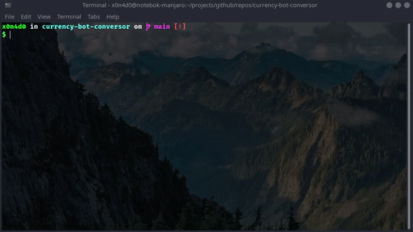

<div align='justify'>

# **Currency Bot Conversor**

![LICENSE] ![ISSUES] ![FORKS] ![STARS]

> A simple bot to convert currencies using Node JS and Puppeteer.

## **About the Project**

This is a simple script that uses Google search to convert currencies. A simulation of searching google through the browser, however, using the terminal.

The parameters passed through the terminal are sent to the browser query string and the result is fetched through the input selector css.

The aim of the project is to study how puppertee works and start developing scripts for automation using web scrapping.

## **Preview**



## **Getting Started**

install the repository dependencies:

```bash
npm install
```

Start script:

```bash
npm run start
```

Testing:

```bash
npm run test
```


## **Techs**

- [nodejs](https://nodejs.org/)
- [puppertee](https://github.com/puppeteer/puppeteer)
- [colors](https://www.npmjs.com/package/colors)
- [readline-sync](https://www.npmjs.com/package/readline-sync)
- [intl](https://developer.mozilla.org/en-US/docs/Web/JavaScript/Reference/Global_Objects/Intl/NumberFormat)

## **License**

[MIT](./LICENSE) &#169; Maurício Romagnoli.

</div>

<!-- BADGES -->

[LICENSE]: https://img.shields.io/github/license/x0n4d0/currency-bot-conversor

[ISSUES]: https://img.shields.io/github/issues/x0n4d0/currency-bot-conversor

[FORKS]: https://img.shields.io/github/forks/x0n4d0/currency-bot-conversor

[STARS]: https://img.shields.io/github/stars/x0n4d0/currency-bot-conversor
